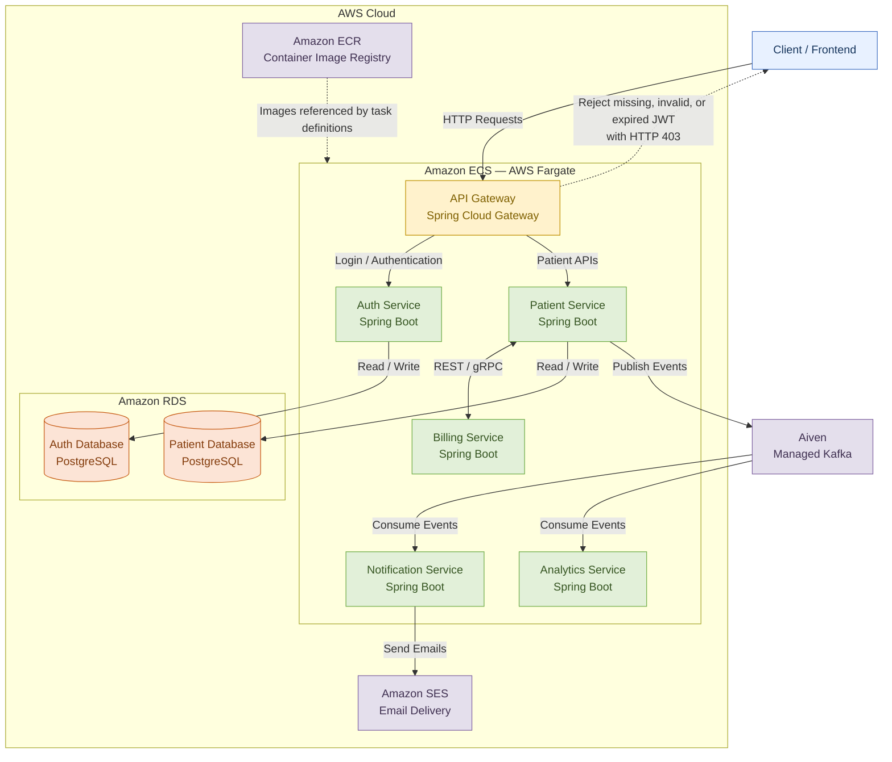

# Patient Management System

A cloud-deployed, event-driven **Patient Management System** built using **Java, Spring Boot, PostgreSQL, Apache Kafka, gRPC, and AWS**. The application follows a microservices architecture with six services, JWT-based authentication, asynchronous event processing, email notifications, and containerized deployment on **AWS ECS with Fargate**.

## Architecture

The application is composed of six microservices, each responsible for a specific business capability.

### Core Components

* **API Gateway:** Built with Spring Cloud Gateway. Acts as the entry point for client requests, validates JWTs on subsequent requests, and routes authorized requests to backend services.
* **Authentication Service:** Handles user login and JWT generation.
* **Patient Service:** Manages patient records and exposes REST APIs for patient-related operations.
* **Billing Service:** Handles billing-related operations and communicates with other services.
* **Analytics Service:** Consumes Kafka events for analytics-related processing.
* **Notification Service:** Integrates with Amazon Simple Email Service (SES) to deliver email notifications.
* **PostgreSQL:** Provides relational data storage through two databases hosted on Amazon RDS.
* **Apache Kafka:** Enables asynchronous, event-driven communication between services, hosted on Aiven.
* **gRPC:** Supports synchronous communication between selected services using Protocol Buffers.
* **AWS ECS with Fargate:** Runs the containerized microservices without requiring direct management of EC2 instances.
* **Amazon ECR:** Stores container images used for deployment.
* **Amazon SES:** Provides managed email delivery for the notification service.

## High-Level Architecture




*Conceptual architecture. The diagram illustrates the major infrastructure and application components. Actual service-to-service connections, Kafka topics, database assignments, and notification triggers should match the deployed configuration.*

## Tech Stack

| Category                | Technologies               |
| ----------------------- | -------------------------- |
| Language                | Java 21                    |
| Backend                 | Spring Boot                |
| API Communication       | REST, gRPC                 |
| Messaging               | Apache Kafka               |
| Messaging Platform      | Aiven                      |
| Database                | PostgreSQL                 |
| Managed Database        | Amazon RDS                 |
| ORM                     | Spring Data JPA, Hibernate |
| API Gateway             | Spring Cloud Gateway       |
| Authentication          | JWT, Bearer Tokens         |
| Serialization           | Protocol Buffers           |
| Email Notifications     | Amazon SES                 |
| Containerization        | Docker                     |
| Container Registry      | Amazon ECR                 |
| Container Orchestration | Amazon ECS                 |
| Compute                 | AWS Fargate                |
| Testing                 | JUnit 5, REST Assured      |
| Build Tool              | Maven                      |
| IDE                     | IntelliJ IDEA              |

## Key Features

### Microservices Architecture

* Decomposed the application into six Spring Boot microservices.
* Separated business capabilities across patient management, billing, authentication, analytics, and notifications, with an API gateway for centralized request handling.
* Enabled independent service development and containerized deployment.

### Synchronous and Asynchronous Communication

* Used REST APIs for client-facing and service interactions.
* Implemented gRPC communication with Protocol Buffers for selected synchronous service-to-service calls.
* Integrated Apache Kafka through Aiven for asynchronous event-driven communication.
* Enabled analytics processing through Kafka event consumption.

### JWT-Based Authentication

* Implemented a dedicated authentication service for user login and JWT generation.
* Added JWT validation at the API Gateway for subsequent requests.
* Rejected requests with missing, invalid, or expired JWTs using `403 Forbidden`.
* Forwarded authenticated requests to the appropriate backend service.

### Email Notifications

* Developed a dedicated notification microservice.
* Integrated Amazon SES for managed email delivery.
* Separated notification functionality from core business services.

### Cloud Deployment

* Containerized application services using Docker.
* Stored container images in Amazon Elastic Container Registry (ECR).
* Deployed six microservices using Amazon ECS with AWS Fargate.
* Hosted two PostgreSQL databases on Amazon RDS.
* Used Aiven for managed Apache Kafka deployment.
* Integrated Amazon SES for email delivery.

## Architecture and Communication Flow

### Authentication Flow

1. The client submits login credentials through the API Gateway.
2. The gateway forwards the login request to the Authentication Service.
3. The Authentication Service authenticates the user and generates a JWT.
4. The token is returned to the client.
5. For subsequent requests, the client sends the JWT in the `Authorization` header as a Bearer token.
6. The API Gateway validates the token.
7. If valid, the gateway forwards the request to the target service.
8. If missing, invalid, or expired, the gateway rejects the request with `403 Forbidden`.

### Event-Driven Processing

1. Services publish events to Kafka when relevant business operations occur.
2. Kafka handles asynchronous event distribution.
3. The Analytics Service consumes relevant events for downstream processing.

### Notification Flow

The Notification Service integrates with Amazon SES to send email notifications. The exact triggering mechanism and event flow depend on the implemented service integration.

## Testing

The application uses JUnit 5 and REST Assured for automated testing.

* **JUnit 5:** Provides the testing framework for writing and executing test cases.
* **REST Assured:** Supports REST API testing, including request execution and response validation.
* **Integration Testing:** Tests API behavior and interactions between application components.

## Deployment Architecture

The application is deployed on AWS using managed cloud infrastructure.

| Component          | Deployment              |
| ------------------ | ----------------------- |
| Microservices      | Amazon ECS              |
| Container Runtime  | AWS Fargate             |
| Container Registry | Amazon ECR              |
| Databases          | Amazon RDS (PostgreSQL) |
| Message Broker     | Aiven (Apache Kafka)    |
| Email Delivery     | Amazon SES              |

### Deployment Overview

1. Build Docker images for the microservices.
2. Push the images to Amazon ECR.
3. Configure ECS task definitions to reference the corresponding container images.
4. Run the services using ECS with AWS Fargate.
5. Configure the services to connect to the managed PostgreSQL databases on Amazon RDS.
6. Configure Kafka connectivity using the Aiven-hosted Kafka cluster.
7. Configure Amazon SES for email delivery from the Notification Service.

The exact networking, IAM permissions, secrets management, load balancing, and deployment configuration depend on the AWS setup.

## Project Structure

```text
patient-management/
├── api-gateway/
├── auth-service/
├── patient-service/
├── billing-service/
├── analytics-service/
├── notification-service/
└── README.md
```

The actual repository structure may vary depending on how the services and shared configuration are organized.

## Future Improvements

* Implement centralized observability and distributed tracing.
* Expand integration and end-to-end test coverage.
* Introduce automated CI/CD pipelines.
* Add resilience patterns such as retries, timeouts, and circuit breakers.
* Improve centralized secrets management and configuration.
* Explore Infrastructure as Code for reproducible cloud infrastructure provisioning.

## Scope

This project covers backend development, microservices architecture, synchronous and asynchronous communication, JWT-based authentication, email notifications, automated testing, and cloud deployment.

The application is deployed using AWS ECS, Fargate, ECR, RDS, SES, and Aiven-hosted Kafka.
